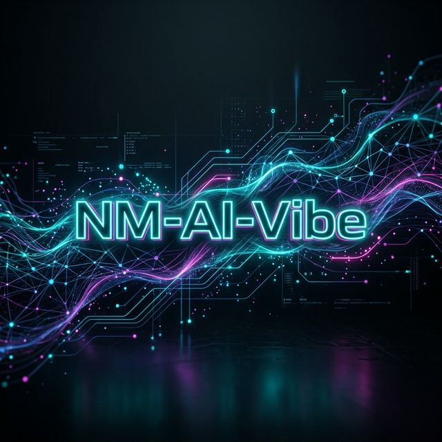

<<<<<<< HEAD
<div align="center">
  

  # 🌌 NM-AI-Vibe
  ### "The ultimate synergy of Neural Intelligence and developer flow."

  [](https://opensource.org/licenses/MIT)
  [](https://github.com/quickburrrn/NM-AI-Vibe)
  [](https://github.com/quickburrrn/NM-AI-Vibe)

---

  **Experience coding like never before.**
  *Minimalism. Speed. AI-Native Flow.*

</div>

## 🚀 Overview

**NM-AI-Vibe** (Neural Matrix AI Vibe) is a next-generation framework designed for developers who code with AI agents. It prioritizes the "Vibe" — the creative intent — over the boilerplate, enabling you to build complex systems at the speed of thought.

Built by [quickburrrn](https://github.com/quickburrrn), this project aims to bridge the gap between human intuition and machine intelligence in a dark-aesthetic, high-performance environment.

---

## ✨ Key Features

- 🧠 **Neural-Native Logic**: Seamlessly integrate with any LLM using the Model Context Protocol (MCP).
- ⚡ **Turbocharged Flow**: Optimized for rapid prototyping and AI-assisted pair programming.
- 🎨 **Minimalist Design**: A clean, distraction-free environment that lets your code breathe.
- 🌈 **Vibrant Ecosystem**: Modular, extensible, and built for the modern AI web.

---

## 🛠 Tech Stack

| Category | Tools |
| :--- | :--- |
| **Core** | AI-Native Frameworks, TypeScript |
| **Styling** | Modern CSS, Glassmorphism, Neon UI |
| **Interface** | Next.js / Vite (Experimental) |
| **Backend** | MCP-Ready Architecture |

---

## 📦 Getting Started

To join the vibe:

```bash
# Clone the repository
git clone https://github.com/quickburrrn/NM-AI-Vibe.git

# Enter the dimension
cd NM-AI-Vibe

# More to come soon...
```

---

## 🤝 Contributing

We welcome any and all contributions! Whether it's adding a new "vibe," fixing a bug, or improving the documentation, feel free to open a PR.

1. Fork the project
2. Create your Feature Branch (`git checkout -b feature/AmazingVibe`)
3. Commit your changes (`git commit -m 'Add some AmazingVibe'`)
4. Push to the Branch (`git push origin feature/AmazingVibe`)
5. Open a Pull Request

---

<div align="center">
  <br>
  Built with 💖 by <b>quickburrrn</b>
  <br>
  <i>"Don't just code. Vibe."</i>
</div>
=======
# Ai NM
## Vibecoders to the top
>>>>>>> 3603bee8804cd8f94b1f163ca8e1d14b6f177924
